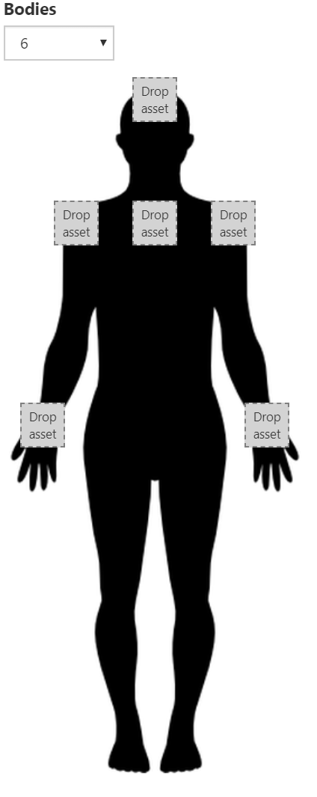

The Kinect API comes in two flavors, depending on which Kinect hardware is used. The `kinect` require works with the Kinect v2, which originally shipped with the Xbox One. The `azure-kinect-preview` require works with the Azure Kinect. This API is still in preview and may change. Kinect v1 is unsupported.

Full example scripts for both types of Kinect may be found in the public script library.

```javascript
const kinect = require('kinect');
// or
const kinect = require('azure-kinect');
```

## Scene Setup

The Kinect JS API is designed to be very simple. A connected Kinect will track bodies in the scene and automatically create and attach elements to joints of detected bodies. Each joint can be configured with a specific attached asset.



Create a Kinect element in the scene and select it to open the accompanying inspector.

## Kinect Context

To use the Kinect, you will need to add a small script to the _parent_ of the Kinect element. This script will turn on the Kinect.

All actions take place through an object called the context. The context should be created on script initialization or on enter. When a script is destroyed or reloaded, the context will automatically be destroyed or pooled, but will not leak.

First, create a context.

```javascript
const ctx = kinect.context();
```

The context can be queried to show if the platform supports Kinect.

```javascript
log.info(ctx.isSupported);
```

Next, start the kinect by passing in the element the Kinect should attach elements to. On exit, the kinect context should generally be stopped.

```javascript
const self = this;

module.exports = {
    enter: function() {
        ctx.startTracking(self);
    },

    exit: function() {
        ctx.stopTracking();
    }
};
```

## Events

The Kinect API will dispatch events when a new body is recognized or when a recognized body has been lost. These events correspond to people entering and exiting the camera feed.

```javascript
function onBodyDetected(element) {
    // element
}

function onBodyLost(element) {
    // elided
}

ctx.on('bodyfound', onBodyDetected);
ctx.on('bodylost', onBodyLost);

...

ctx.off('bodyfound');
ctx.off('bodylost';
```

## Mirror

The Kinect API will composite the camera feed into the scene using real depth. However, depending on whether the user is looking at themselves in a display or other people are watching the user through a display, you may want to mirror the composite image. This is done by simply setting the `mirrorComposite` field on the context.

```javascript
ctx.startTracking(self);
ctx.mirrorComposite = true;
```

## Debugging

Sometimes it can be useful to visualize the depth feed coming from the Kinect. Setting `debugDepth` to true will show a black and white depth feed instead of Color data.

```javascript
ctx.debugDepth = true;
```


## Azure Kinect Specifics

The Azure Kinect has a few additional APIs that the Kinect V2 does not have. Since the depth image used for compositing refreshes at a slower rate than the screen, use `depthDecay` to effectively blur the depth in between frames. This is measured in seconds.

```javascript
context.depthDecay = 0.2;
```

Use `maxDepth` to control the maximum distance the Kinect feed can render overtop AR content. This can be helpful when trying to show AR content as a backdrop.

```javascript
context.maxDepth = 5;
```

Use `maxDepthEllipse` to provide greater control over `maxDepth`. Separate values can be exposed for controlling the maximums for height vs depth, realtive to the camera.

```javascript
context.maxDepthEllipse = v.create(10, 10, 0);
```

## Post Processing (Azure Kinect)

PostProcessing basics can be controlled and configured through the context. A default PostProcessing profile exists, so not every example control listed needs to be set.

Control the overall PostProcessing layer.

```javascript
ctx.postProcessing.enabled = true;
```

Control Bloom and its related settings.

```javascript
ctx.postProcessing.bloom.enabled = true;
ctx.postProcessing.bloom.intensity = 6;
ctx.postProcessing.bloom.threshold = 3.5;
ctx.postProcessing.bloom.softKnee = 2;
ctx.postProcessing.bloom.diffusion = 5;
ctx.postProcessing.bloom.color = col(0.2, 0.6, 0.4, 1);
```

Control the Vignette and its related settings.

```javascript
ctx.postProcessing.vignette.enabled = true;
ctx.postProcessing.vignette.color = col(0, 1, 1, 1);
ctx.postProcessing.vignette.center = vec3(0.5, 0.5, 0);
ctx.postProcessing.vignette.intensity = 6;
ctx.postProcessing.vignette.rounded = true;
```

Control Auto Exposure related settings.

```javascript
ctx.postProcessing.exposure.enabled = true;
ctx.postProcessing.exposure.filtering = vec3(0.6, 0.9, 0);
ctx.postProcessing.exposure.maximum = 3;
ctx.postProcessing.exposure.minimum = 6.5;
ctx.postProcessing.exposure.compensation = 5;
```

## Module Methods

### `context([id])`
- `id <string>` [Optional] The id of a specific Kinect.
- Returns a `KinectContext` or `AzureKinectContext` depending on the module loaded.

Creates a Kinect context.

## `KinectContext` Properties

### `isSupported <bool>` [Read Only]

True if the Kinect is supported on this platform.

### `id <string>` [Read Only]

The id of this Kinect.

### `mirrorComposite <bool>`

True if the composite video feed should be mirrored.

### `debugDepth <bool>`

True if the composite video feed is debugging depth.

## `KinectContext` Methods

### `startTracking(element)`
- `element <Element>` The element the Kinect should attach child element to.

Starts the Kinect.

### `stopTracking()`

Stops the Kinect.

## `AzureKinectContext` Properties

### `isSupported <bool>` [Read Only]

True if the Kinect is supported on this platform.

### `id <string>` [Read Only]

The id of this Kinect.

### `mirrorComposite <bool>`

True if the composite video feed should be mirrored.

### `debugDepth <bool>`

True if the composite video feed is debugging depth.

### `maxDepth <number>`

The maximum depth at which the Kinect renders.

### `maxDepthEllipse <vec3>`

The maximum depth at which the Kinect renders, separating x, y, and z.

### `depthDecay <number>`

How long valid depth values are held after invalidation.

### `postProcessing <PostProcessing>`

Post-processing properties for the composite feed.

## `AzureKinectContext` Methods

### `startTracking(element)`
- `element <Element>` The element the Kinect should attach child element to.

Starts the Kinect.

### `stopTracking()`

Stops the Kinect.

## `PostProcessing` Class Properties

### `enabled <bool>`

### `bloom.enabled <bool>`
### `bloom.intensity <number>`
### `bloom.threshold <number>`
### `bloom.softKnee <number>`
### `bloom.diffusion <number>`
### `bloom.color <col4>`

### `vignette.enabled <bool>`
### `vignette.color <col>`
### `vignette.center <vec3>`
### `vignette.intensity <number>`
### `vignette.rounded <bool>`

### `exposure.enabled <bool>`
### `exposure.filtering <vec3>`
### `exposure.maximum <number>`
### `exposure.minumum <number>`
### `exposure.compenstaion <number>`
