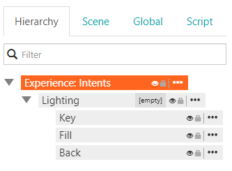
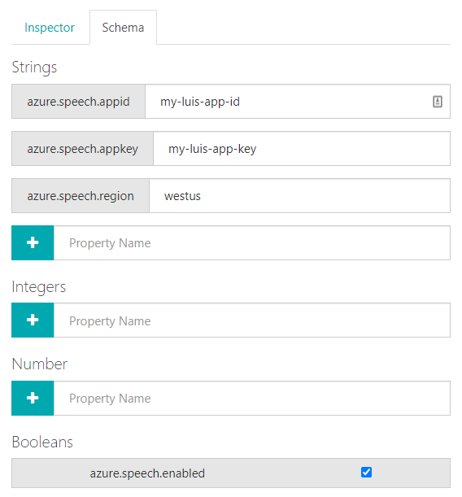

We have a preview API for Azure's Language Understanding service (LUIS). This allows users to define natural language models via LUIS and recognize those intents in Enklu behaviors.

## Azure Setup

First, setup a LUIS account at the [LUIS portal](https://www.luis.ai/home). The documentation will guide you through creating your own model. Your Azure information can then be entered in the Scene inspector.

While the API is in preview, some manual setup is required. Ensure the root element of the current scene is selected.



Then, add the four necessary entries to the root schema.



When `azure.speech.enable` is `true`, the experience will send audio to you LUIS app when running on a device. The other three values for `azure.speech.appid`, `azure.speech.appkey`, `azure.speech.region` should match the App Id, App Key, and region for your LUIS app. 

## API

Once configuration is complete, register for events from the `speech-preview` api. Register for either intent events, which are data structures that understand what a user _wants_, or speech events, which provide raw text data when LUIS cannot determine an intent.

```javascript
const speech = require('speech-preview');

// speech is not currently available on all platforms
if (speech.isAvailable()) {
    speech.on('onintent', function(result) {
        // an intent was recognized!
    });

    speech.on('onspeech', function(speech) {
        // an intent was not recognized but speech was
    });
}
```

### Module Events

- "onintent"
- "onspeech"

### Module Methds

### `on(event, callback)`
- `event <string>` The event to subscribe to.
- `callback <function>` The callback to invoke. For the "onspeech" event, the raw text is passed as an argument. The "onintent" event receives an `IntentResult` object.

Subscribes to an event.

### `off(event, [callback])`
- `event <string>` The event to unsubscribe from.
- `callback <function>` *[Optional]* A specific callback to unsubscribe. If not provided, registration for all handlers will be removed.

Unsubscribes from an event.

### `isAvailable()`
- Returns: A `bool` if speech is available.

Returns `true` if speech recognition is available on the current device.

## `IntentResult` Class Properties
### `query <string>`

The raw recognized text.

### `topScoringIntent <TopScoringIntent>`

The intent ranked most likely by LUIS.

### `entities <Entity[]>`

Predefined entities reference by the intent.

## `TopScoringIntent` Class Properties
### `intent <string>` 

The name of the recognized intent

### `score <number>`

A number between 0 and 1 indicating LUIS' confidence that this intent was correctly identified.

## `Entity` Class Properties
### `entity <string>`

The name of the `Entity`.

### `type <string>`

The type of entity, as defined in the LUIS portal.

### `startIndex <number>`

The starting index into the intent query string.

### `endIndex <number>`

The end index into the intent query string.

### `score <number>`

A number between 0 and 1 indicating LUIS' confidence that this entity is correctly identified.
