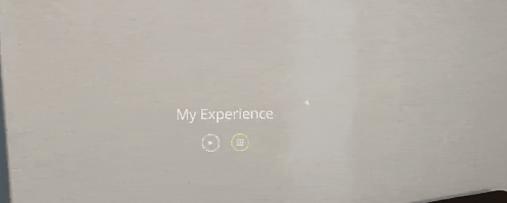
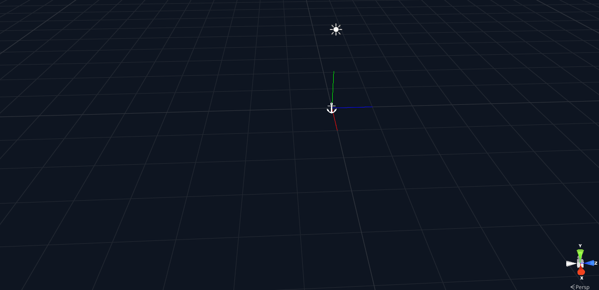
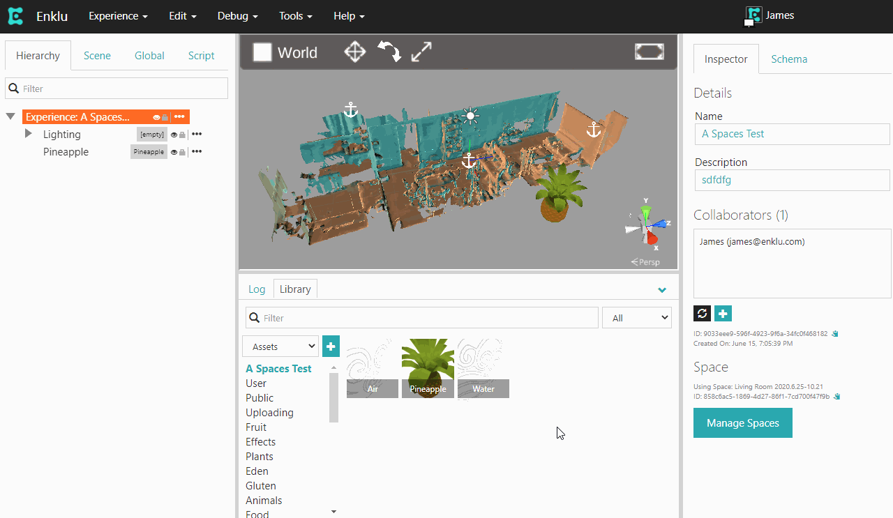
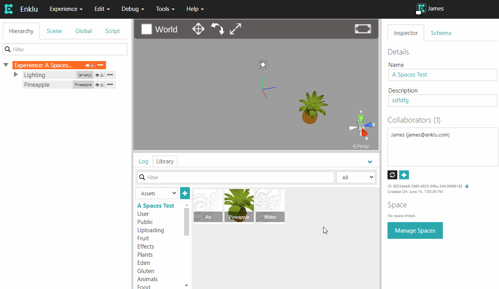

A Space anchors your AR content to the physical world. Everything you create in Enklu Cloud will perfectly line up with the environment around you, enabling multiple users to view holograms in the same location.
A single Space can be used in multiple experiences to help build worlds of adventure in your environment as quickly as possible.

> <b>Note:</b> An active internet connection is required to create a Space.

## Getting Started

By default, all new experiences are Free Floating. Since free floating content starts relative to the device's position, the experience will appear in different locations between sessions. 

To create a new Space, using your HoloLens 1 or HoloLens 2 device, enter Edit Mode by saying "edit experience". 
Once in Edit Mode, activate the floating menu and select <b>Spaces</b>. To activate the menu, focus your gaze cursor on the button with the grid icon.

Select <b>Create New</b>. A Space will be created, and scanning will begin automatically.

### Scanning your environment

While the device is scanning, the scan it creates will be shown. Walk around your environment at a comfortable pace. As the device refines its understanding of the environment, the scan you see will update in real time.

Continue moving until all of the environment you want included in your experience is visible. The edges of the scan will have a red border, as well as any holes in the scan. 
A prompt will appear automatically confirming whether you are finished scanning or still need more time.

Be sure to capture major features in your environment, such as the corners of walls and large furniture that will not move. 
The scan is used both in the Cloud Editor and for occlusion on device. More time spent making a better scan will result in easier development and increased immersion.
If you have the cloud editor open, you'll be able to see the visualization update in real time as you scan.

### Anchor Uploading

When the scan is complete, the system will automatically generate anchors for the environment. Anchors are required to lock AR content to your physical world. 
The anchor upload progress will be displayed below the floating menu. Once the upload finishes, you will be notified and be able to return to Edit Mode.

Anchors can be moved around, as well as manually created. More information can be found in our article about <a href='/docs/Spaces/AddingAnchors'>Adding Anchors</a>.

In the uncommon event of an error, the anchors will change to red. If you see this, try autogenerating the anchors again from the available menu. If the issue persists, please contact support@enklu.com.

## Removing a Space

When an Experience is using a Space, it can be switched back to Free Floating in one of two ways. With your HoloLens, you can enter Edit Mode, select <b>Spaces</b>, then <b>Switch to Free Floating</b>. 

In the cloud editor, the inspector includes a <b>Space Management</b> section. This will let you change the current Experience to use a different Space, or none.

> <b>Note:</b> When a Space is not in use, it still exists and can be re-used at any time in the future. A Space can be permanently deleted through the device or Enklu Cloud.
In Enklu Cloud, click <b>Space Management</b> followed by the trash can icon next to a space's name.
On your HoloLens, from the Space menu in Edit Mode, select <b>Manage All</b> and navigate to the Space you wish to delete. Once loaded, it can be deleted from the options menu floating nearby.  

## Use an Existing Space

An experience can use an existing Space through both the HoloLens and the cloud editor. The HoloLens can view available spaces and activate an existing one from the menu in Edit Mode.

Similarly, the cloud editor will display available spaces in its <b>Space Management</b> section. Selecting a space will preview it. Clicking <b>Use Space</b> will confirm the change and update other devices actively using the space.

