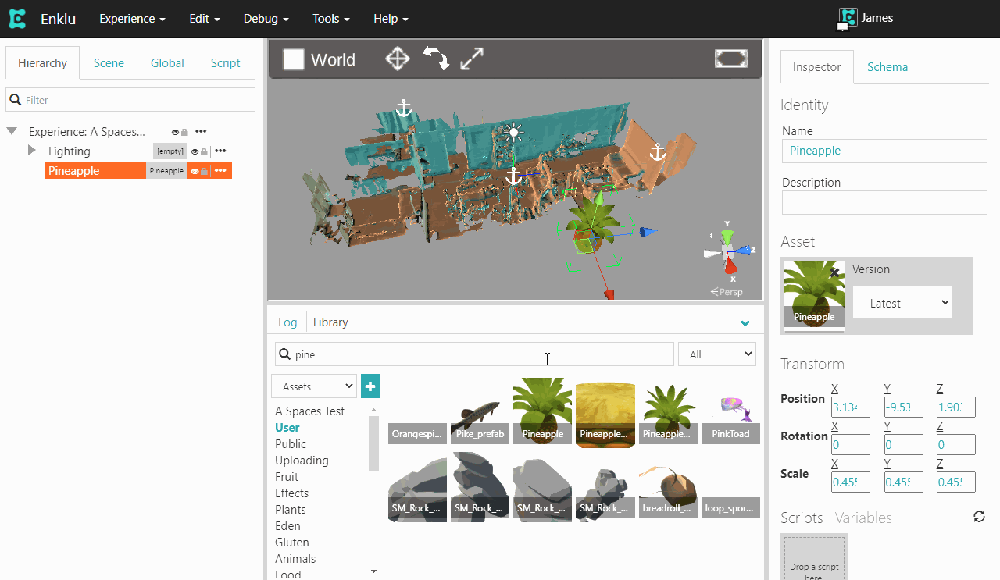
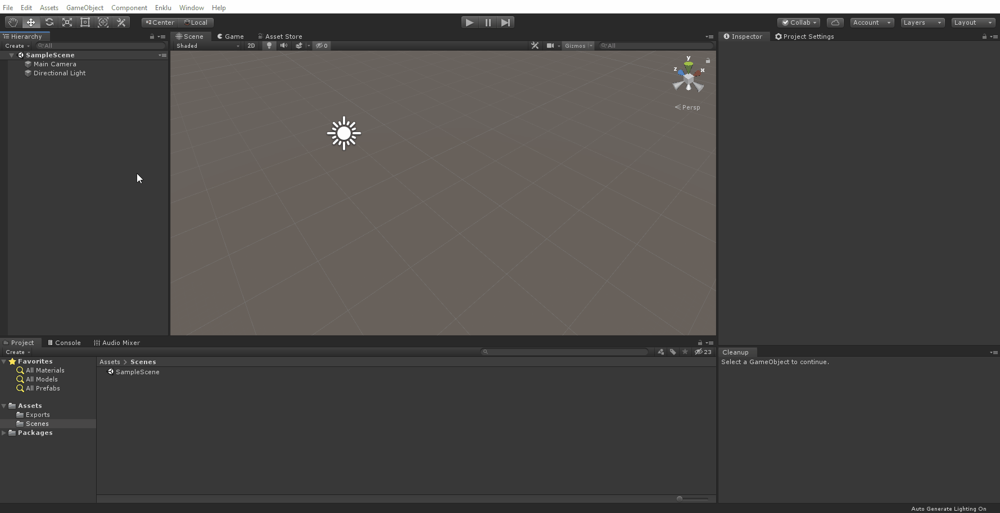

*[Note: Access to some features mentioned in this article require a Studio Subscription. [Contact us](/contact) for details.]*

## Downloading

In Enklu Cloud, select the root of the experience in the Hierarchy, then select <b>Manage Spaces</b> from the inspector.
All of the Spaces associated with your account are shown here. To download a scan, select the <b>Download</b> icon to the right of the Space's name.

This will download the space as a <b>.mesh</b> file.

## Using the mesh

### Install EnkluPlayer into Unity

At the core of Enklu Cloud is the Enklu Player project, a Unity package that is hosted on GitHub and accessible to users with a Studio Subscription. To convert a mesh, the first step is to add this package to a new or existing Unity project. Instructions for installing the package are available in the Enklu Player Readme or in Unity's documentation on installing a package from GitHub.

Once you have added the package, you are ready to either import the mesh directly into your Unity project or convert it to a Wavefront .obj file.

### Importing into Unity

To create a game object representing the mesh in your Unity scene, use the Enklu > Mesh > Import Meshes menu command. 
After selecting the file you just downloaded, it will appear in your scene.

### Converting to a Wavefront .obj

While creating Unity Game Objects is convenient, you may want to convert into a more general format for use in animation or modelling software. 
For this, you can convert the mesh to an .obj file by using the Enklu > Mesh > Convert Mesh to OBJ command.

The converted .obj file can then be used in any standard 3d modeling/editing application like Maya or Blender.

